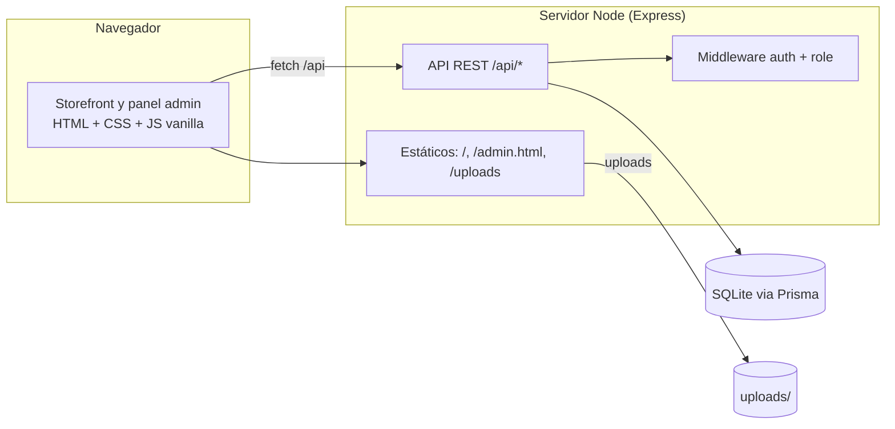
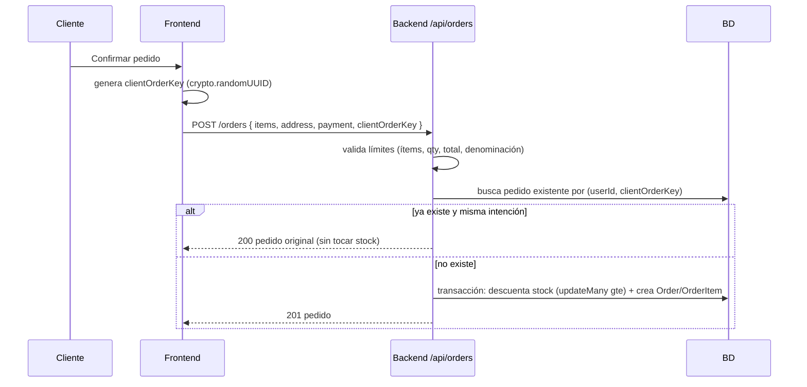
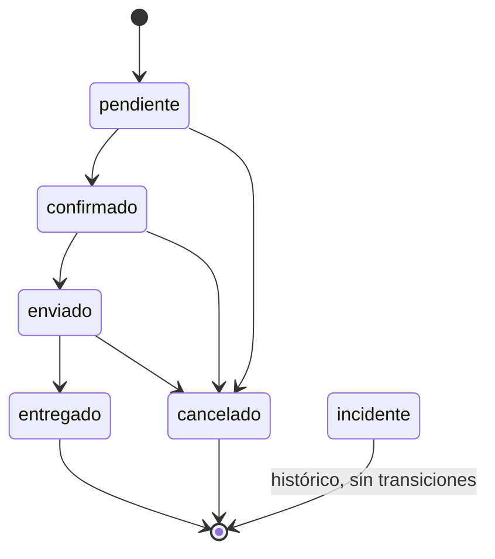

# Arquitectura de City Pets

Documento técnico de referencia de la arquitectura real del proyecto.

---

## 1. Vista general

City Pets es una aplicación **monolítica** servida por Express: el mismo proceso
Node sirve la API REST (`/api/*`) y los archivos estáticos del frontend
(`index.html`, `admin.html`, `css/`, `js/`, `assets/`, `uploads/`). El frontend es
JavaScript vanilla (sin framework) y habla con la API mediante `fetch` con rutas
relativas (`/api/...`).



El frontend se sirve desde la raíz del repositorio (`path.resolve(__dirname, '..')`
relativo a `city-pets-backend/server.js`). El backend bloquea el acceso a
`city-pets-backend/` y `.git` por HTTP.

---

## 2. Persistencia: Prisma + SQLite

- ORM **Prisma 6**, motor **SQLite** (un archivo).
- `prisma/schema.prisma` define los modelos: `User`, `Pet`, `Product`, `Order`,
  `OrderItem`, `Feedback`, `Attribution`, `StoreSettings`, `StoreClosure`.
- La ruta de la BD se configura con `DATABASE_URL` (relativa a `prisma/` en dev,
  absoluta en prod).
- Las migraciones están versionadas en `prisma/migrations/` y se aplican con
  `npx prisma migrate deploy` (no destructivo).

Modelos clave:

```mermaid
erDiagram
  User ||--o{ Order : orders
  User ||--o{ Pet : pets
  User ||--o{ StoreClosure : closures
  User ||--o{ Attribution : attributions
  Product ||--o{ OrderItem : items
  Order ||--|{ OrderItem : items
  Order {
    string status
    datetime createdAt
    datetime deliveredAt "nullable"
    string clientOrderKey "nullable"
  }
  OrderItem {
    string name "snapshot"
    int price "snapshot"
    int qty
    string productId "nullable (SetNull si se borra)"
  }
  StoreClosure {
    string from "YYYY-MM-DD"
    string to "YYYY-MM-DD"
    int total "snapshot"
    int efectivo
    int digital
    int cantidadPedidos
  }
```



`OrderItem` es un **snapshot histórico**: guarda `name`, `price` y `image` al
momento del pedido. Si el producto se elimina después, `productId` pasa a `null`
y el histórico se conserva.

---

## 3. Flujo general de una compra



Detalles clave:

- Los **precios, subtotal, domicilio y total se recalculan en el servidor**; el
  cliente nunca los envía como confiables.
- El descuento de stock es atómico: `updateMany({ where: { id, stock: { gte: qty } } })`
  dentro de la misma transacción que crea el pedido. Si falla, todo revierte.
- La idempotencia evita pedidos duplicados y doble descuento ante reintentos.

---

## 4. Idempotencia de creación (`clientOrderKey`)

- El frontend genera una clave única por intención (`crypto.randomUUID()`, con
  fallback). Se reutiliza solo mientras la intención (carrito + dirección + pago)
  no cambie; se regenera al cambiar o tras completar la compra.
- El backend valida: string de 1–128 caracteres.
- **Huella determinista de intención** (solo datos históricos, nunca precios):
  `items (productId:qty ordenado) + address + payment.method:denomination`.
- Restricción de BD `@@unique([userId, clientOrderKey])` como protección final
  ante solicitudes simultáneas: el perdedor recibe `P2002`, su transacción se
  revierte (incluido el stock) y se devuelve el pedido existente.
- Respuestas: `201` (primera), `200` (repetición idéntica → mismo pedido, sin
  nuevo descuento), `409` (misma clave, intención distinta), `400` (clave inválida).

---

## 5. Control de stock

- **Nunca negativo:** el descuento usa `stock >= qty` de forma atómica.
- **Restauración exacta en cancelación:** al pasar un pedido activo a `cancelado`
  se incrementa el stock por cada ítem con `productId` válido, dentro de la misma
  transacción que cambia el estado. Ítems con `productId` nulo (producto borrado)
  se omiten.
- Doble cancelación concurrente → el CAS + la unicidad del flujo evitan el doble
  incremento (ver §6).

---

## 6. Flujo de estados y protección CAS

Estados y transiciones válidas (constante `ORDER_TRANSITIONS` en `constants.js`):



- `incidente` es histórico: se muestra pero **no** se asigna ni transiciona.
- **CAS (compare-and-swap):** `updateOrderStatus` aplica la transición con
  `updateMany({ where: { id, status: estadoLeido } })` dentro de la transacción.
  Si no afecta exactamente un pedido (otro proceso lo cambió), aborta y responde
  `409`. La restauración de stock por cancelación ocurre **después** de asegurar la
  transición. `deliveredAt` se fija en la misma operación atómica.

---

## 7. deliveredAt y criterio de recaudo

- Al marcar `entregado` se establece `deliveredAt` (una sola vez; no se sobrescribe).
- El **recaudo** (`GET /api/admin/revenue`) y los **cierres** (`POST /api/admin/closures`)
  cuentan únicamente pedidos con `status = entregado`, clasificados por:

```sql
-- equivalencia en Prisma
WHERE status = 'entregado'
  AND ( deliveredAt BETWEEN rango
        OR ( deliveredAt IS NULL AND createdAt BETWEEN rango ) )
```

Es decir: `COALESCE(deliveredAt, createdAt)` — `deliveredAt` cuando existe y
**fallback a `createdAt`** para entregados históricos.

---

## 8. Cierres de caja como snapshots

- `POST /api/admin/closures` recibe `period`/`from`/`to`, calcula el recaudo **en
  el backend** y guarda el resultado (`total`, `efectivo`, `digital`,
  `cantidadPedidos`) como **fotografía histórica**.
- Los cierres **no se recalculan** si los pedidos cambian después.
- Unicidad `@@unique([from, to])` + manejo de `P2002`: dos cierres concurrentes al
  mismo rango producen un `201` y un `409`; nunca dos cierres.
- `GET /api/admin/closures` lista el historial con el administrador que lo creó.

---

## 9. Panel de administración

- Los endpoints administrativos viven bajo `/api/admin` y exigen `authRequired` +
  `requireRole('admin')` (rol leído de la BD en vivo).
- **Listado de pedidos paginado:** `GET /api/admin/orders?page&limit&q&from&to&status&sort`
  responde `{ items, total, page, limit, pages, totalVal, byStatus }`.
  - `byStatus`/`totalVal` se calculan sobre `q+from+to` (sin el filtro de pestaña).
  - `sort=estado` se resuelve **en SQL antes de paginar** (CASE con la secuencia de
    negocio + desempate `createdAt DESC, id DESC`).
- **Filtros:** búsqueda (cliente/teléfono/ID), estado, rango de `createdAt`, orden.
- **Detalle y acciones:** el modal muestra el detalle completo y solo las
  transiciones permitidas según el estado actual.
- **Recaudo y cierres:** ver §7 y §8.
- **Exportación CSV:** `GET /api/admin/export/orders` y
  `GET /api/admin/export/closures` (filtros respetados; exporta todos los
  coincidentes; anti-fórmula + BOM).

---

## 10. Healthcheck, shutdown y logging

- **Healthcheck:** `GET /api/health` ejecuta `SELECT 1` → `200` (BD ok) o `503`
  (BD degradada), sin tumbar el proceso.
- **Shutdown limpio:** `SIGTERM`/`SIGINT` cierran el servidor HTTP y desconectan
  Prisma (con force-exit de 10 s). Las transacciones SQLite revierten ante un corte.
- **Logging estructurado:** `src/logger.js` emite una línea JSON por evento con
  `level`, `time`, `msg` y (si aplica) `errMessage`/`errCode`. El **contexto está
  restringido por allowlist** (`path`, `method`): nunca se registran tokens,
  contraseñas, cuerpos de peticiones ni objetos arbitrarios.

---

## Mejoras futuras (opcionales, no bloqueantes)

- Proveer una variante segura de `scripts/test-integral.sh` para CI (con
  `BACKUP_DIR`/`UPLOADS_PATH` redirigidos a `/tmp`), porque hoy G14 elimina
  `backups/` y escribe en `uploads/`.
- Fijar el dominio real en las etiquetas `og:*` de `index.html` (placeholder).
- Unificar los mensajes `[FATAL]` de arranque en el logger estructurado.
- Configurar la zona horaria del negocio (`TZ`) para los rangos de recaudo.
- Revisar/diferir los advisories de `npm audit` (dev/transitivos) cuando los
  "fixes" no sean downgrades que rompan Prisma/ExcelJS.

Estas mejoras son opcionales y no bloquean el cierre funcional.